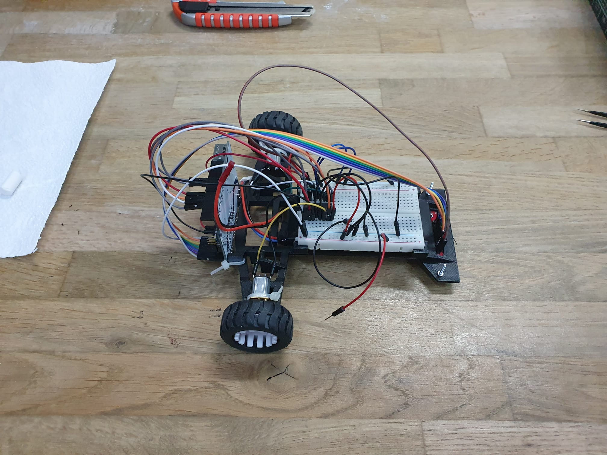
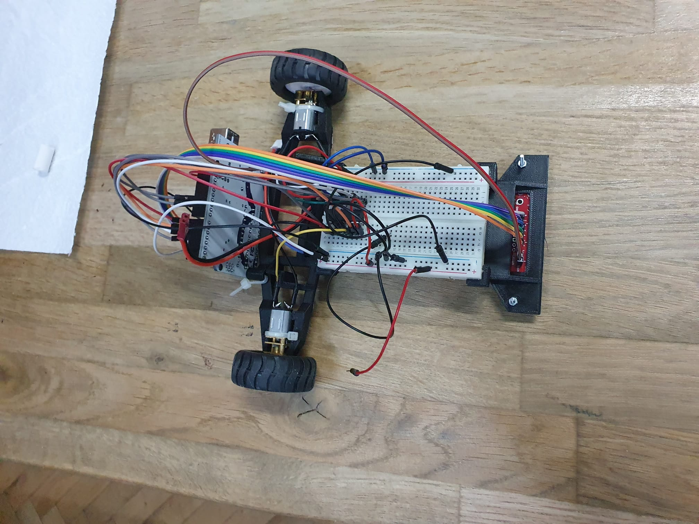

# Line-follower---IntroductionToRobotics 2023

#### Description
Assemble a line follower robot and write the code for it so that it can do any route in the shortest possible time and in the correct way (that is, to keep the line it is on, to be able to turn correctly without entering other lanes, etc. ).
To achieve this we used PID, is a control loop mechanism employing feedback that is widely used in industrial control systems and a variety of other applications requiring continuously modulated control.
 

### Used components
<ul>
  <li> Arduino Uno
  <li> Zip-ties
  <li> Power source (can be of different shape). In our case, a LiPo battery
  <li> Wheels (2)
  <li> Wires for the line sensor (female - male)
  <li> QTR-8A reflectance sensor, along with screws
  <li> Ball caster
  <li> Extra wires from the kit or lab
  <li> Chassis
  <li> Breadboard - medium (400pts)
  <li> L293D motor driver
  <li> DC motors (2)
</ul>  

### Parameters
- We did an automatic calibration of 10 seconds using the alternative start of the engines and after that we repositioned the line follower on the line.
- We map the error from sensors to [-30, 30] interval and apply PID with kp = 11, ki = 0, kd = 1, p = 1, i = 0, d = 0 (we tried a lot of configuration until we get the best one which is the one that we used).

### Context and details
- We received the line follower kit.
- We assembled it.
- We programmed it to complete the course as fast as possible.

### Results
- The best time that out line follower get was 23.262s.

### Our team name: Team Oltenia
### I teamed up with <a href= "https://github.com/mihaibirsan28/Line-follower---IntroductionToRobotics">Mihai Birsan</a> 

## Pictures

## Video 
https://youtu.be/bK9JmgAIRBg
