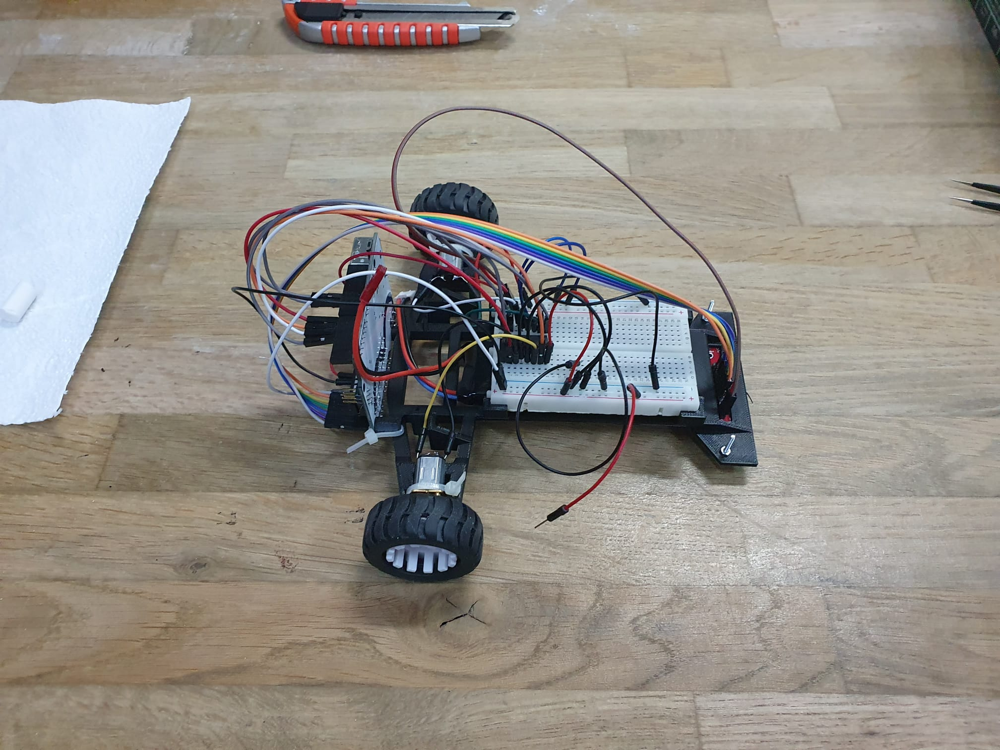
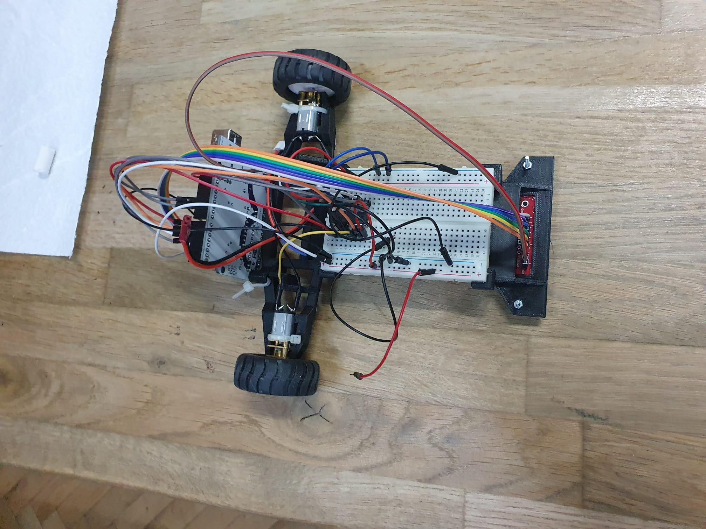

# 🚗 **Line Follower Robot** 🤖 — *IntroductionToRobotics 2023* 

## Description 🌟
Assemble a line follower robot and program it to navigate any route in the shortest possible time while staying perfectly on track. The robot is designed to follow the line, execute precise turns, and avoid veering off course. We achieved this precision using a **PID control loop**—a robust feedback mechanism widely used in industrial systems and various continuously modulated applications. 🔄🛠️

## Used Components 🛠️🔧
- **Arduino Uno** 🎛️
- **Zip-ties** 🧷
- **Power Source:** (Our choice: LiPo battery) 🔋
- **Wheels (2)** ⚙️
- **Wires for the line sensor:** (female-male) 🔌
- **QTR-8A Reflectance Sensor** with screws 🧲
- **Ball Caster** 🎡
- **Extra Wires** from the kit or lab 🪢
- **Chassis** 🚙
- **Breadboard (medium, 400pts)** ⚡
- **L293D Motor Driver** 🚦
- **DC Motors (2)** ⚡

## Parameters 📏🔍
- **Automatic Calibration:**  
  A 10-second calibration routine is performed using an alternative engine start mechanism, after which the robot is repositioned onto the line. ⏱️
- **PID Tuning:**  
  - Sensor error is mapped to the interval **[-30, 30]**.  
  - PID parameters:  
    - `kp = 11`  
    - `ki = 0`  
    - `kd = 1`  
    - `p = 1`, `i = 0`, `d = 0`  
  *(We experimented with several configurations to achieve the best performance.)* 🎛️🔧

## Context and Details 📝
- **Kit Received:** Yes!  
- **Assembly:** We carefully assembled the line follower kit. 🔩  
- **Programming:** The robot was programmed to complete the course as fast and accurately as possible. 💻🏁

## Results 🏆
- **Best Time Achieved:** **23.262 seconds** ⏱️🥇

## Team & Collaboration 🤝
- **Our Team Name:** **Team Oltenia** 🌟  
- **Collaboration:** I teamed up with [Mihai Birsan](https://github.com/mihaibirsan28/Line-follower---IntroductionToRobotics) for this project.

## Visuals
- **Project Setup Image 📸**  
    
  

- **Video 🎥**  
  [Watch the Line Follower in Action](https://youtu.be/bK9JmgAIRBg)
